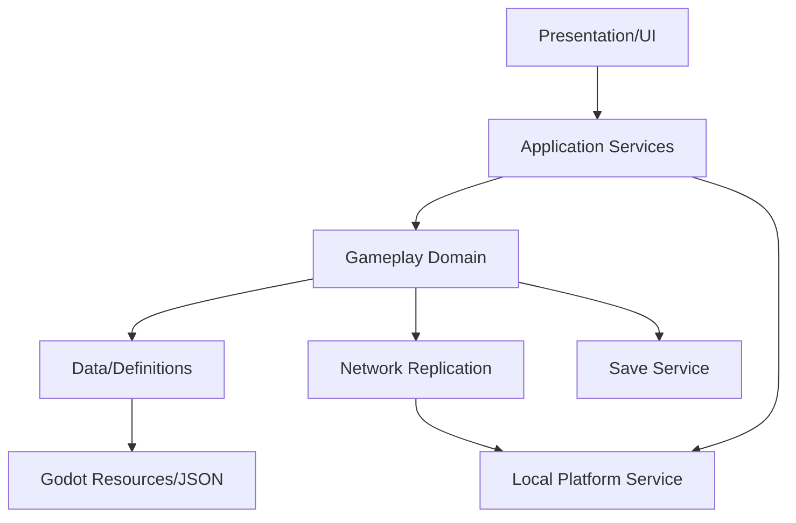

# 01. Technical Architecture — GitHub Distribution Track

## 1. 고정 기술 스택
- Engine: Godot 4.7.2 stable, .NET build
- Language: C# 중심, shader는 Godot shading language
- Renderer: Forward+
- Physics: GodotPhysics 3D + 잠수정 custom force integration
- Audio: Godot AudioServer + bus/effect
- Network: Godot high-level multiplayer + `ENetMultiplayerPeer`
- LAN discovery: UDP broadcast beacon (`PacketPeerUDP`)
- NAT helper: Godot `UPNP`를 이용한 자동 port mapping 시도
- Build: Windows x86_64 portable export
- Distribution: GitHub Releases `.zip`
- Backend: 없음

## 2. 레이어 구조


## 3. 권장 프로젝트 구조
```
res://
  src/
    App/
      GameBootstrap.cs
      SceneFlowService.cs
      DependencyRegistry.cs
    Domain/
      Submarine/
      Sonar/
      Pressure/
      Noise/
      Creature/
      Salvage/
      Inventory/
      Contract/
      Progression/
    Net/
      INetworkTransport.cs
      EnetTransport.cs
      HostAuthority.cs
      SnapshotReplicator.cs
      RpcValidator.cs
      LanDiscoveryService.cs
      UpnpPortMapper.cs
      ReconnectService.cs
    Platform/
      IPlatformService.cs
      DesktopPlatformService.cs
    Persistence/
      SaveManager.cs
      SaveMigration.cs
      AtomicFileStore.cs
    Presentation/
      Hud/
      Menus/
      Accessibility/
    Infra/
      Logging/
      Pooling/
      Diagnostics/
  data/
  scenes/
  shaders/
  audio/
  art/
  tests/
```

## 4. Scene Flow
`Boot -> MainMenu -> HostOrJoin -> Lobby -> Loadout -> RunLoading -> InRun -> Settlement -> MainMenu`

### Boot 실패 정책
- config 손상: 기본값 재생성
- save 손상: backup restore 제안
- network 초기화 실패: solo는 계속 사용 가능
- optional asset 누락: placeholder + error log

## 5. Tick 모델
- Physics: 60 Hz
- Host gameplay simulation: 30 Hz
- Baseline snapshot: 15 Hz
- 중요 상태: event 또는 30 Hz
- AI expensive query: staggered 5~10 Hz
- UI: render frame independent

## 6. 잠수정 물리 안정성
- 6DOF Rigidbody 기반
- pitch/roll 자동 안정화 PID
- collision용 convex compound hull 사용
- visual mesh와 collider 분리
- tunnel clearance probe
- 5초 stuck detector
- 1-run당 Emergency Winch 기본 1회

### Stuck 판정
1. `linear_velocity < 0.15 m/s`
2. 유효 throttle > 0.5
3. 5초 지속
4. 주변 normal sample 기반 탈출 벡터 계산
5. 2초간 보조 impulse
6. 실패 시 Emergency Winch 표시

## 7. Sonar renderer
- depth prepass
- sonar origin/radius global shader parameter
- response-tagged world object
- wavefront 교차 시 emission 기록
- 3~6초 history fade
- low preset은 half-resolution history + 단순 edge

Gameplay contact 계산은 host domain에서 하고, shader는 시각 표현만 담당한다.

## 8. 데이터 주도 설계
stable string ID를 사용한다.
- `ModuleDefinition`
- `CreatureDefinition`
- `ContractDefinition`
- `RelicDefinition`
- `BiomeDefinition`
- `RoomDefinition`

저장 파일에는 Godot resource path 대신 stable ID를 기록한다.

## 9. Platform abstraction
Steam 등의 store SDK는 v2.1 범위에 포함하지 않는다.

`IPlatformService`는 아래 로컬 기능만 제공한다.
- open save/log folder
- copy text to clipboard
- open project/homepage URL
- OS/version query
- support bundle path 반환

이 경계를 유지하면 추후 store integration을 추가하더라도 gameplay 코드를 변경하지 않는다.

## 10. 로그/프라이버시
- `user://logs/game_YYYYMMDD_HHMMSS.log`
- INFO/WARN/ERROR
- random session GUID 사용
- IP address는 기본 로그에 저장하지 않거나 마지막 octet masking
- 패킷 payload 원문 저장 금지
- analytics endpoint 없음
- diagnostics upload 자동 수행 금지
